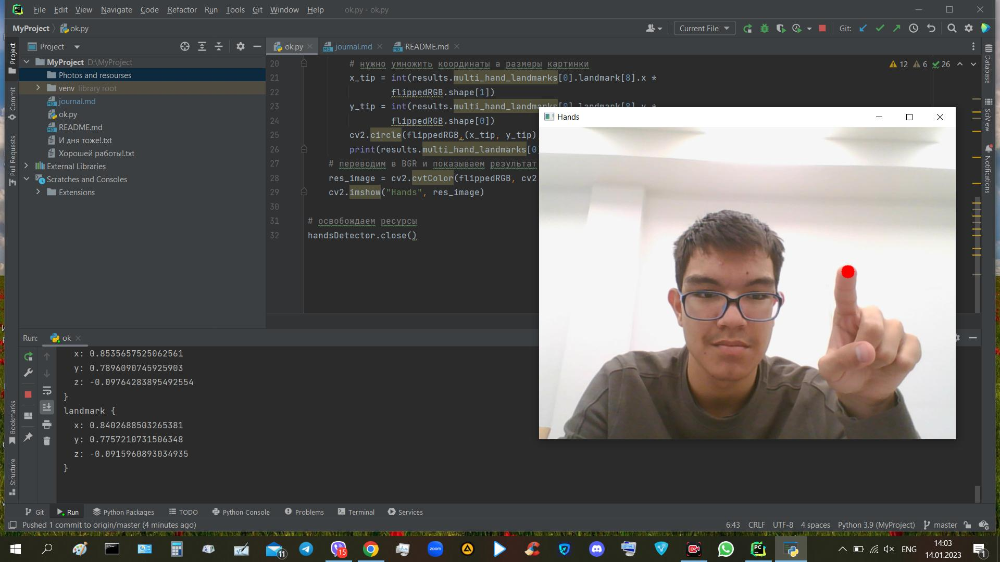
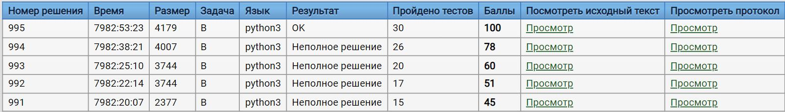
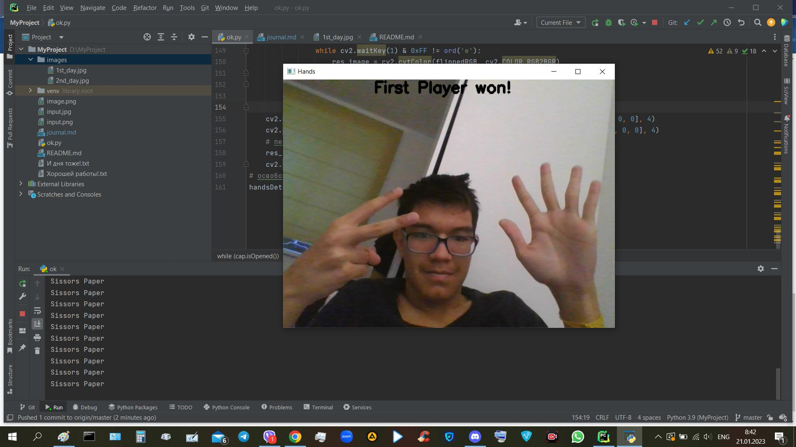

# Камень, ножницы, бумага

###### Собственно мой проект! В чем суть, здесь будет предоставлена полная информация о том каким образом происходил процесс работы. По завершению, в конце будет предоставлен полная инструкция пользования моим продуктом. А теперь начнем! 

    Все коды и работа будет написана на языке Python
    Использованные библиотеки: 
    1)Mediapipe(Модуль Hands основное ядро нашей игры)
    2)Numpy(Для удобства работы со списками)
    3)Opencv(Основная работа с картинкой, в нашем случае видео)

# Основная сводка
Задачей моего проекта является создание всем известной игры, но теперь на компьютерах! То есть концепция такова, мы играем в реальном мире так чтобы камера захватывала все происходящее, начисляла нам очки за каждую "битву рук". Счет идет до трех побед, после определяется победитель. Путь создания будет состоять из нескольких пунктов.
1) Разобраться в том каким образом определять руки. Освоение курса в кенвасе и задача по определению положений рук будет главной задачей на этот период.
2) После разработки главных функций мне надо будет теперь занести их в основной продукт, то есть создание самой игры(видео, счетчик очков и тд).
3) Полноценная проверка и доработка конечного продукта, написание инструкции. 
# Процесс
14.01.2023 - Взят код из кенваса, который поможет мне разобраться и в дальнейшем разобраться с определением положений рук(камень, ножницы, бумага)

20.01.2023 - Наконец-то после некоторого времени(2-3 часа) я смог выполнить главную задачу - написать код определяющий формы руки

21.01.2023 - А вот и конечный продукт, было сложно но сделано. Была сделана сама игра.
 

